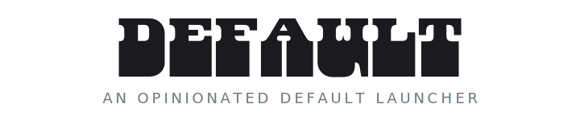
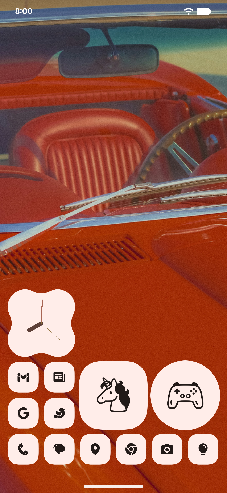
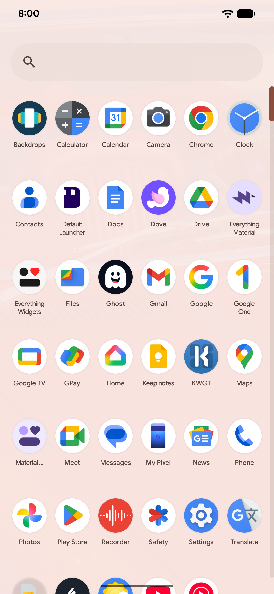
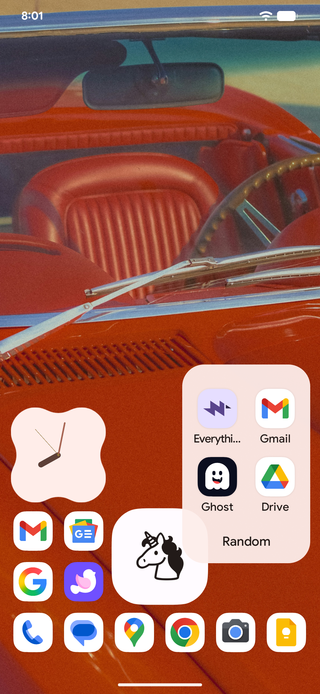
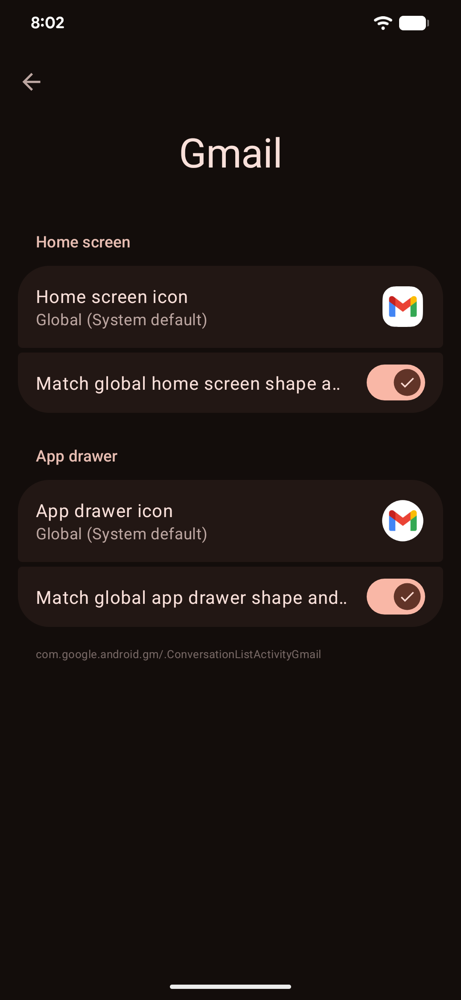
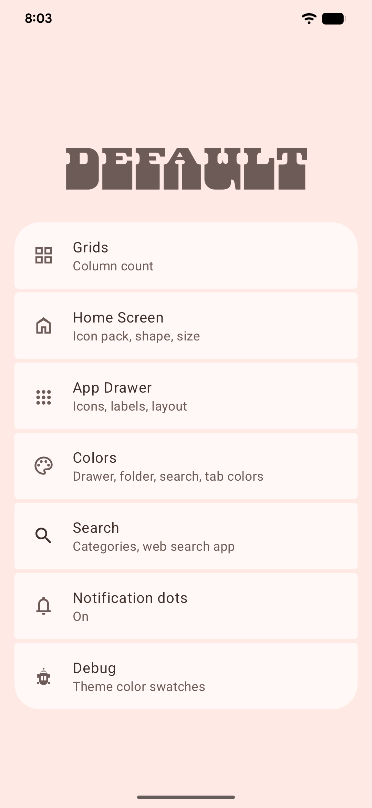
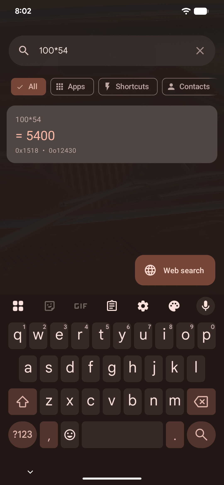
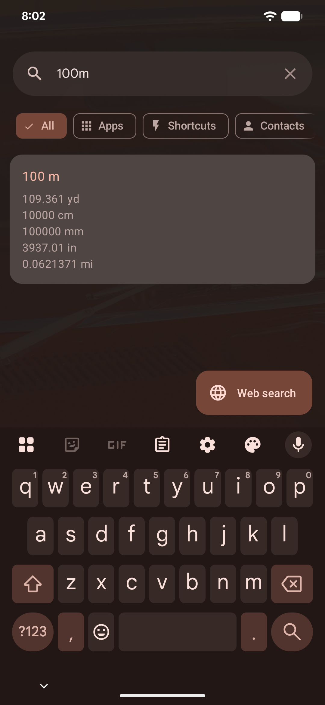
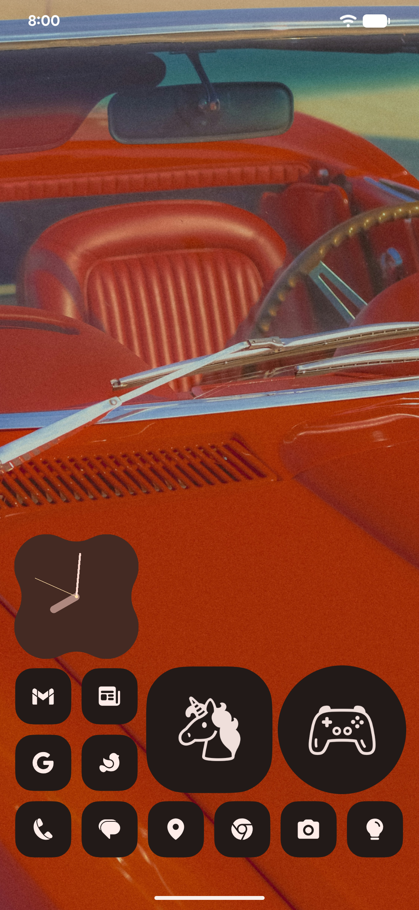

  <picture>
    <source media="(prefers-color-scheme: dark)" srcset=".github/banner-dark.svg">
    <source media="(prefers-color-scheme: light)" srcset=".github/banner.svg">
    
  </picture>

  A custom Android launcher built on <strong>AOSP Launcher3</strong> (Android 16). 
  Stripped of clutter. Tuned for phones. Styled with Material 3.

  
  
  
  

  
  

---

## Features

### Privacy First

- Fully offline — no internet connections, no telemetry, no tracking
- Your data stays on your device

### Smart Grid

- Pick your columns (4 to 10) — rows are calculated automatically so every cell is a perfect square
- Icons rearrange themselves when you change the grid — nothing gets deleted
- The dock is part of the grid with the same spacing, not a separate floating bar

### Icon Customization

- Thousands of icon packs supported (ADW format)
- Choose a shape for your icons: circle, square, cookie, arch, or raw
- Customize individual app icons from the long-press menu — different icons for the home screen and app drawer

### Folders

- **Cover icons** — replace the mini-icon preview with a monochrome emoji from a searchable picker
- **Expanded folders** — display folder contents directly on the home screen as a 2x2 or 3x3 grid with tap-to-launch
- **Resize** — drag corner handles to grow or shrink folders on the workspace
- **Per-folder shapes** — override the global icon shape on individual folders
- **Customizable colors** — separate background colors for folder icons, open panels, and covers

### App Drawer

- Adjustable label size and two-line labels for long app names
- Configurable row spacing
- Background color and opacity controls
- Custom scrollbar color

### Widget Stacks

- Stack multiple widgets in a single grid cell and swipe between them
- Bottom sheet editor to reorder, remove, and add widgets
- Page indicator dots with smooth animations

### Universal Search

- Search apps, shortcuts, contacts, calendar events, and files from one place
- Built-in calculator, unit converter, and timezone converter
- Timezone queries: "5pm India to Chicago", "chicago time", "4pm chicago time tuesday to tokyo"
- Quick actions auto-detect phone numbers, emails, and URLs in your query
- AI search FAB sends your query to ChatGPT, Claude, or Gemini
- Choose your web search app
- Filter results with category chips

### Colors

- Material 3 dynamic colors from your wallpaper
- Full dark mode support
- Customizable drawer background, search bar, tab, and folder colors

### Gestures

- Swipe down for notifications
- Swipe up for the app drawer

## Screenshots

  
  
  

  
  
  

  
  
  

## Documentation

For architecture documentation, see [`docs/`](docs/). For implementation change logs, see [`docs/changes/`](docs/changes/).

## Credits

- [AOSP Launcher3](https://android.googlesource.com/platform/packages/apps/Launcher3/): the foundation
- [yuchuangu85/Launcher3](https://github.com/yuchuangu85/Launcher3): Gradle port with prebuilt framework stubs
- [Kvaesitso](https://github.com/MM2-0/Kvaesitso): inspiration for the universal search system
- [Lawnchair](https://github.com/LawnchairLauncher/lawnchair): settings UI patterns (card groups, preference styling)

## License

This project uses a dual-license model:

- **AOSP Launcher3 code** is licensed under the [Apache License 2.0](LICENSE) (original copyright The Android Open Source Project)
- **Custom code** written for DefaultLauncher is licensed under the [GNU General Public License v3.0](LICENSE-GPL)

See each source file's header for which license applies.
